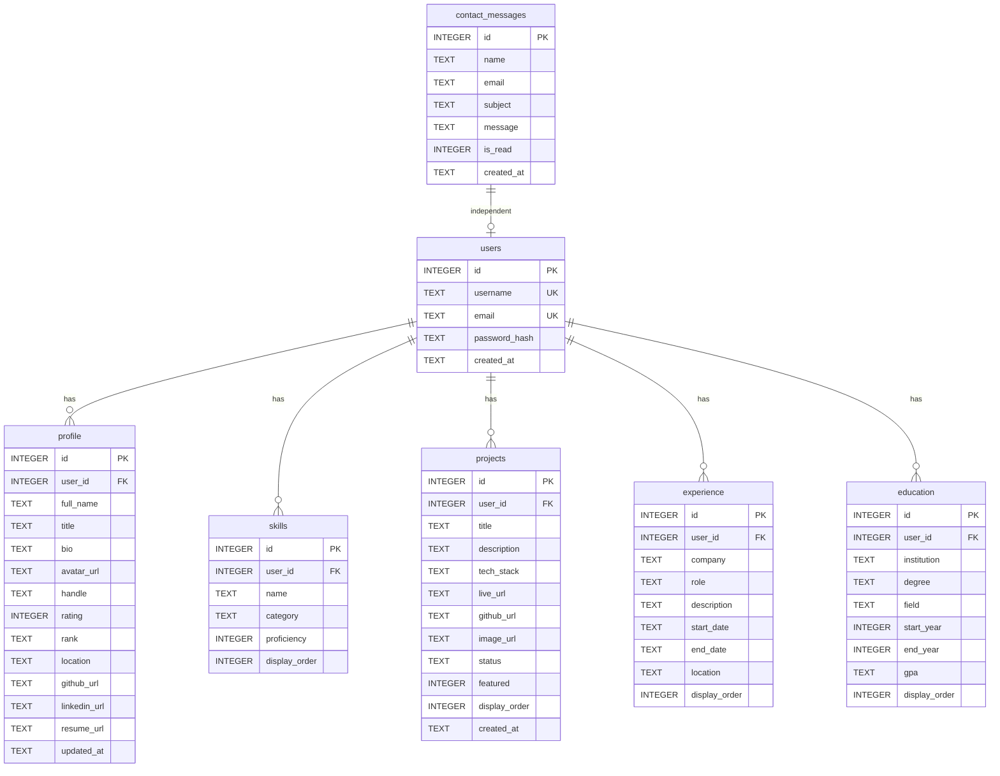

# Database Schema Documentation

## Overview

The portfolio application uses **SQLite** as its database engine with **Drizzle ORM** for type-safe query building. The database file (`portfolio.db`) is stored in the project root directory.

## Entity-Relationship Diagram

## Tables

### 1. `users`

Admin users for the portfolio system. Currently supports a single admin user.

| Column | Type | Constraints | Description |
|---|---|---|---|
| `id` | INTEGER | PK, AUTOINCREMENT | Unique user identifier |
| `username` | TEXT | UNIQUE, NOT NULL | Login username |
| `email` | TEXT | UNIQUE, NOT NULL | User email address |
| `password_hash` | TEXT | NOT NULL | bcrypt-hashed password |
| `created_at` | TEXT | DEFAULT CURRENT_TIMESTAMP | Account creation timestamp |

### 2. `profile`

Personal profile information displayed on the portfolio home page.

| Column | Type | Constraints | Description |
|---|---|---|---|
| `id` | INTEGER | PK, AUTOINCREMENT | Unique identifier |
| `user_id` | INTEGER | FK → users(id) | Associated user |
| `full_name` | TEXT | NOT NULL | Display name |
| `title` | TEXT | | Professional title (e.g., "Full Stack Developer") |
| `bio` | TEXT | | About me / biography text |
| `avatar_url` | TEXT | | URL to profile image |
| `handle` | TEXT | | CF-style username/handle |
| `rating` | INTEGER | DEFAULT 0 | CF-style rating number |
| `rank` | TEXT | DEFAULT 'newbie' | CF-style rank title |
| `location` | TEXT | | Geographic location |
| `github_url` | TEXT | | GitHub profile URL |
| `linkedin_url` | TEXT | | LinkedIn profile URL |
| `resume_url` | TEXT | | Resume download URL |
| `updated_at` | TEXT | DEFAULT CURRENT_TIMESTAMP | Last update timestamp |

**Rating/Rank Color Scale:**

| Rank | Rating Range | Color |
|---|---|---|
| Newbie | 0 - 1199 | Gray (#808080) |
| Pupil | 1200 - 1399 | Green (#008000) |
| Specialist | 1400 - 1599 | Cyan (#03a89e) |
| Expert | 1600 - 1899 | Blue (#0000ff) |
| Candidate Master | 1900 - 2099 | Violet (#aa00aa) |
| Master | 2100 - 2299 | Orange (#ff8c00) |
| International Master | 2300 - 2399 | Orange (#ff8c00) |
| Grandmaster | 2400 - 2599 | Red (#ff0000) |
| Legendary Grandmaster | 2600+ | Dark Red (#cc0000) |

### 3. `skills`

Technical skills with proficiency ratings.

| Column | Type | Constraints | Description |
|---|---|---|---|
| `id` | INTEGER | PK, AUTOINCREMENT | Unique identifier |
| `user_id` | INTEGER | FK → users(id) | Associated user |
| `name` | TEXT | NOT NULL | Skill name (e.g., "JavaScript") |
| `category` | TEXT | | Grouping category ("Language", "Framework", "Tool") |
| `proficiency` | INTEGER | DEFAULT 0 | Proficiency level 0-100 |
| `display_order` | INTEGER | DEFAULT 0 | Custom sort order |

### 4. `projects`

Portfolio projects showcased on the site.

| Column | Type | Constraints | Description |
|---|---|---|---|
| `id` | INTEGER | PK, AUTOINCREMENT | Unique identifier |
| `user_id` | INTEGER | FK → users(id) | Associated user |
| `title` | TEXT | NOT NULL | Project name |
| `description` | TEXT | | Detailed description |
| `tech_stack` | TEXT | | Comma-separated technologies |
| `live_url` | TEXT | | Deployed project URL |
| `github_url` | TEXT | | Source code repository URL |
| `image_url` | TEXT | | Project screenshot URL |
| `status` | TEXT | DEFAULT 'completed' | Project status |
| `featured` | INTEGER | DEFAULT 0 | 1 = featured on home page |
| `display_order` | INTEGER | DEFAULT 0 | Custom sort order |
| `created_at` | TEXT | DEFAULT CURRENT_TIMESTAMP | Creation timestamp |

**Status values:** `completed`, `in-progress`, `archived`

### 5. `experience`

Professional work experience entries.

| Column | Type | Constraints | Description |
|---|---|---|---|
| `id` | INTEGER | PK, AUTOINCREMENT | Unique identifier |
| `user_id` | INTEGER | FK → users(id) | Associated user |
| `company` | TEXT | NOT NULL | Company/organization name |
| `role` | TEXT | NOT NULL | Job title |
| `description` | TEXT | | Role responsibilities |
| `start_date` | TEXT | | Start date (YYYY-MM format) |
| `end_date` | TEXT | | End date (NULL = current position) |
| `location` | TEXT | | Job location |
| `display_order` | INTEGER | DEFAULT 0 | Custom sort order |

### 6. `education`

Educational background entries.

| Column | Type | Constraints | Description |
|---|---|---|---|
| `id` | INTEGER | PK, AUTOINCREMENT | Unique identifier |
| `user_id` | INTEGER | FK → users(id) | Associated user |
| `institution` | TEXT | NOT NULL | School/university name |
| `degree` | TEXT | NOT NULL | Degree type |
| `field` | TEXT | | Field of study |
| `start_year` | INTEGER | | Start year |
| `end_year` | INTEGER | | End year (NULL = ongoing) |
| `gpa` | TEXT | | GPA or score |
| `display_order` | INTEGER | DEFAULT 0 | Custom sort order |

### 7. `contact_messages`

Messages submitted through the public contact form.

| Column | Type | Constraints | Description |
|---|---|---|---|
| `id` | INTEGER | PK, AUTOINCREMENT | Unique identifier |
| `name` | TEXT | NOT NULL | Sender's name |
| `email` | TEXT | NOT NULL | Sender's email |
| `subject` | TEXT | | Message subject |
| `message` | TEXT | NOT NULL | Message body |
| `is_read` | INTEGER | DEFAULT 0 | Read status (0/1) |
| `created_at` | TEXT | DEFAULT CURRENT_TIMESTAMP | Submission timestamp |

## ORM Schema

The Drizzle ORM schema is defined in `src/lib/db/schema.ts`. The JavaScript/TypeScript column names use camelCase, while the database column names use snake_case.

## Database Operations

All database operations are implemented as **Next.js Server Actions** in `src/lib/actions.ts`:

- **Public** (no auth): `getProfile`, `getSkills`, `getProjects`, `getExperience`, `getEducation`, `submitContactForm`
- **Admin** (auth required): `updateProfile`, `createProject`, `updateProject`, `deleteProject`, `createSkill`, `updateSkill`, `deleteSkill`, `createExperience`, `updateExperience`, `deleteExperience`, `markMessageRead`, `deleteMessage`
